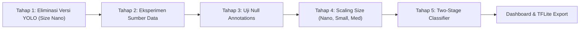

# 🦐 SMARTAMBAK: Shrimp Health & Disease Detection with YOLO

Sistem deteksi dan klasifikasi kesehatan udang berbasis computer vision (YOLO) yang dioptimasi untuk mendeteksi penyakit udang tambak (seperti IMNV, WFD, WSSV) serta kebal terhadap deteksi palsu (*false-positive*) pada objek non-udang untuk kebutuhan aplikasi mobile.

---

## 📌 1. Latar Belakang & Masalah

Pada model deteksi awal:
- **Target Kelas:** `Healthy Shrimp` dan kelas penyakit (`IMNV`, `WFD`, `WSSV`, dll).
- **Masalah Utama:** Model sering mengalami **false-positive ber-confidence tinggi (hingga 90%+)** pada objek non-udang (misal: wajah manusia atau tangan terdeteksi sebagai udang sakit).
- **Tujuan Riset:** Mengembangkan sistem deteksi yang:
  1. Akurat melokalisasi dan mengklasifikasikan kondisi kesehatan udang.
  2. Kebal terhadap objek non-udang / lingkungan tambak (*robust out-of-distribution rejection*).
  3. Ringan, cepat, dan hemat daya saat dikonversi ke format mobile (**TensorFlow Lite**).

---

## 📂 2. Struktur Direktori Proyek

```text
SMARTAMBAK/
├── dataset/
│   ├── scrap/
│   │   └── negative_images/        # 860 gambar mentah non-udang hasil scraping
│   ├── OOD_TEST/                   # 400 gambar benchmark uji OOD (lokal, 8 kategori)
│   ├── ROBOFLOW_NEGATIVES/         # 460 gambar negatif training untuk diunggah ke Roboflow
│   └── roboflow/                   # Folder hasil unduhan dataset dari Roboflow
│
├── scripts/
│   ├── scrape_negative_images.py   # Script scraping 860 gambar negatif (hard negatives)
│   └── dataset_splitter.py         # Script pemisah OOD_TEST dan ROBOFLOW_NEGATIVES
│
├── docs/
│   ├── agent.md                    # Dokumen spesifikasi riset YOLO & OOD
│   ├── rencana_experiments.txt     # Catatan eksperimen awal
│   └── langkah_langkah_eksperimen.md # Panduan komprehensif roadmap eksperimen
│
├── notebook.ipynb                  # Notebook utama eksekusi training & benchmarking
├── pyproject.toml / uv.lock        # Manajemen dependensi environment Python (uv)
└── README.md                       # Dokumentasi utama proyek
```

---

## 🔬 3. Rangkaian Eksperimen yang Dilakukan

Eksperimen dirancang secara bertingkat (*funnel strategy*) untuk memaksimalkan efisiensi komputasi:



### 🔹 Tahap 1: Eliminasi Versi YOLO (Ukuran Nano `n`)
- **Tujuan:** Mencari arsitektur terbaik dengan komputasi teringan.
- **Model yang Diuji:** `yolov8n.pt`, `yolov9t.pt`, `yolov10n.pt`, `yolo11n.pt`, `yolo12n.pt`, `yolo26n.pt`.
- **Hasil:** Memilih 1 arsitektur pemenang (`YOLO_BEST_NANO`, misal: YOLO11n).

### 🔹 Tahap 2: Eksperimen Sumber Dataset
- **Tujuan:** Mengetahui sumber data yang menghasilkan generalisasi terbaik.
- **Variasi:** Data Internal (tim lapangan) vs Data External (internet) vs Combined (gabungan).

### 🔹 Tahap 3: Eksperimen Null Annotations & Ketahanan False-Positive
- **Tujuan:** Menguji efektivitas penambahan 460 gambar latar belakang tanpa anotasi (*null annotations*) baik pada model **Biner** maupun **Multiclass**.
- **Evaluasi OOD Benchmark:** Menguji model langsung pada 400 gambar non-udang (`dataset/OOD_TEST/`) untuk menghitung **OOD False Positive Rate (FPR)**.

### 🔹 Tahap 4: Eksplorasi Model Scaling (Nano $\rightarrow$ Small $\rightarrow$ Medium)
- **Tujuan:** Menguji trade-off antara kenaikan mAP50 dengan pertambahan ukuran file (MB) dan latensi inferensi pada smartphone.
- **Variasi:** `YOLO_BEST_n` vs `YOLO_BEST_s` vs `YOLO_BEST_m`.

### 🔹 Tahap 5: Model Klasifikasi *Two-Stage* (`shrimp and not shrimp`)
- **Tujuan:** Memisahkan deteksi keberadaan udang dari klasifikasi penyakit menggunakan arsitektur dua tahap.

### 🔹 Tahap 6: Dashboard Visualisasi & Ekspor TFLite
- Rangkuman metrik mAP50, mAP50-95, Precision, Recall, dan **Perbandingan Ukuran Model (MB)**.
- Ekspor model terbaik ke **TensorFlow Lite (FP16 & INT8)** untuk deployment aplikasi Android/iOS.

---

## 🛠️ 4. Panduan Menjalankan Script & Notebook

### 1. Scraping Gambar Negatif
Mengunduh 860 gambar non-udang (*hard negatives*: manusia, tangan, ikan, kerang, air tambak, dll):
```bash
uv run python scripts/scrape_negative_images.py
```

### 2. Memisahkan Dataset Uji OOD & Training Negatives
Memisahkan otomatis 400 gambar ke `dataset/OOD_TEST/` (benchmark lokal) dan 460 gambar ke `dataset/ROBOFLOW_NEGATIVES/` (diunggah ke Roboflow):
```bash
uv run python scripts/dataset_splitter.py
```

### 3. Menjalankan Training (`notebook.ipynb`)
1. Buka file `notebook.ipynb` di Jupyter / VS Code.
2. Di **Section 0**, sesuaikan hyperparameter global jika diperlukan (`EPOCHS`, `IMGSZ`, `BATCH`, `DEVICE`).
3. Di **Section 1**, jalankan download dataset Roboflow sesuai versi yang ingin dilatih.
4. Jalankan sel training bertahap dari **Section 2** (Tahap 1) hingga **Section 8** (Ekspor TFLite).
5. Lihat grafik perbandingan akurasi dan ukuran model (MB) pada **Section 7**.

---

## 📊 5. Target Standar Evaluasi

| Komponen | Metrik | Target Optimal |
| :--- | :--- | :---: |
| **Akurasi Deteksi Udang** | mAP@0.5 / Recall Udang | $\ge 90\%$ |
| **Ketahanan Non-Udang (OOD)** | OOD False Positive Rate (400 gambar) | $< 5\%$ (Mendekati $0\%$) |
| **Ukuran Model Mobile** | File Size format TFLite INT8 | $\le 2.5 \text{ MB}$ (Nano) / $\le 6 \text{ MB}$ (Small) |
| **Latensi Inferensi Mobile** | Kecepatan inferensi di CPU/NPU smartphone | $< 60 \text{ ms}$ ($> 15 \text{ FPS}$) |
