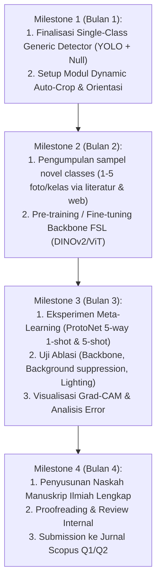

# Rencana Penelitian Ilmiah: Framework Hybrid Deteksi Generik & Few-Shot Learning untuk Diagnosis Spesies dan Penyakit Udang Langka

---

## 1. Identitas Rencana Penelitian

- **Topik Riset:** Computer Vision, Few-Shot Learning, Smart Aquaculture, Zero-Annotation-Effort Disease Diagnosis.
- **Usulan Judul Paper (Bahasa Inggris):**
  > *"A Zero-Annotation-Effort Hybrid Framework: Robust Generic Object Detection and Metric Few-Shot Learning for Rare Shrimp Species and Emerging Disease Diagnosis in Smart Aquaculture"*
- **Usulan Judul Paper (Bahasa Indonesia):**
  > *"Kerangka Hibrida Deteksi Generik Robust dan Few-Shot Learning Metrik Tanpa Anotasi Bounding Box untuk Diagnosis Spesies dan Penyakit Udang Langka pada Tambak Cerdas"*
- **Target Publikasi:**
  - Jurnal Internasional Bereputasi Scopus Q1/Q2:
    - *Computers and Electronics in Agriculture* (Elsevier, Impact Factor: 7.7)
    - *Aquacultural Engineering* (Elsevier, Impact Factor: 3.2)
    - *Smart Agricultural Technology* (Elsevier)
    - *IEEE Access* (IEEE)

---

## 2. Latar Belakang & Research Gap

### 2.1. Problematika Nyata di Industri Tambak Udang
1. **Keanekaragaman Spesies Udang Air Payau & Air Tawar:**
   - Di alam dan budidaya komersial terdapat sedikitnya **8 spesies udang penting**:
     1. Udang Beras (*Caridina gracilirostris*)
     2. Udang Palemon / Hias (*Palaemonetes / Macrobrachium*)
     3. Udang Dogol / Krosok (*Metapenaeus monoceros*)
     4. Udang Jerbung / Putih Lokal (*Penaeus merguiensis*)
     5. Udang Lar / Sungai
     6. Udang Galah (*Macrobrachium rosenbergii*)
     7. Udang Windu (*Penaeus monodon*)
     8. Udang Vaname (*Litopenaeus vannamei*)
   - **Kondisi Dataset Saat Ini:** Baru tersedia **3 spesies** (Galah, Windu, Vaname). Lima spesies lainnya sangat minim data dan belum tersedia di benchmark publik.

2. **Spektrum Luas Penyakit Udang (Emerging / Rare Diseases):**
   - Terdapat **12 penyakit utama** yang mematikan dan sering menyerang tambak:
     1. BWSS (*Bacterial White Spot Syndrome*)
     2. AHPND (*Acute Hepatopancreatic Necrosis Disease / EMS*)
     3. Blackgill (*Penyakit Insang Hitam*)
     4. Yellowhead Virus (*YHV*)
     5. WSSV (*White Spot Syndrome Virus*)
     6. EHP (*Enterocytozoon hepatopenaei*)
     7. Blackspot / Shell Disease
     8. IMNV (*Infectious Myonecrosis Virus*)
     9. IHHNV (*Infectious Hypodermal and Hematopoietic Necrosis*)
     10. TSV (*Taura Syndrome Virus*)
     11. Vibriosis (Luminescence Bacterial Disease)
     12. WFD (*White Feces Disease*)
   - **Kondisi Dataset Saat Ini:** Baru terkumpul **5 penyakit** (`blackgill`, `yellowhead`, `wssv`, `wfd`, `imnv`). Tujuh penyakit lainnya (seperti AHPND, EHP, BWSS, TSV) sangat langka atau hanya muncul sesekali pada wabah musiman tertentu, sehingga **sangat sulit mengumpulkan ratusan foto berlabel untuk training konvensional**.

---

### 2.2. Critical Review & Evaluasi Terhadap Tesis Terdahulu (FSOD)
Pada tesis sebelumnya, pendekatan yang digunakan adalah **Few-Shot Object Detection (FSOD)**. Namun, evaluasi praktis dan teknis menunjukkan sejumlah kelemahan mendasar:
1. **High Annotation Cost & Burden (Beban Anotasi Bounding Box Berat):**
   - Pada FSOD, setiap kali ada spesies udang baru atau penyakit baru yang langka, teknisi lapangan atau peneliti **tetap diwajibkan menggambar koordinat bounding box** secara presisi pada foto-foto tersebut.
   - Udang di tambak sering berukuran kecil, transparan, saling bertumpuk di dalam air keruh, atau berenang cepat. Menggambar bounding box secara manual sangat menyita waktu (*labor-intensive*), mahal, dan rentan terhadap ketidakkonsistenan anotasi antar manusia.
2. **Instabilitas Training Kepala Lokalisasi pada Data Sangat Sedikit:**
   - Kepala regresi bounding box pada FSOD membutuhkan banyak data spasial untuk konvergen. Ketika jumlah sampel hanya $K = 1$ hingga $5$ shot, akurasi lokalisasi sering anjlok drastis (kotak meleset atau menangkap latar belakang air tambak).

---

### 2.3. Paradigma Baru yang Diusulkan: Two-Stage Hybrid (Generic Detector + FSL Classifier)
Daripada memaksa melatih lokalisasi dan klasifikasi sekaligus secara few-shot, kita memisahkan masalah menjadi dua tahapan:
1. **Deteksi Lokasi Udang bersifat Universal (Generic):**
   - Bentuk morfologi udang (antena, rostrum, karapas, pleopod, telson) relatif konsisten di seluruh spesies. Kita dapat melatih detektor kelas tunggal (**Generic Shrimp Detector**) menggunakan dataset udang yang sudah ada dan diperkuat *null annotations* agar 100% kebal terhadap false alarm non-udang (tangan, air, ikan).
2. **Klasifikasi Spesies & Penyakit Bersifat Adaptif (Few-Shot Learning):**
   - Bounding box udang yang terdeteksi dipotong secara dinamis (*Dynamic Auto-Crop*).
   - Potongan gambar udang diteruskan ke **Few-Shot Learning Classifier** berbasis *Metric Learning* (misal: Prototypical Networks / Cosine-Similarity ViT).
   - **Keunggulan Utama:** Saat ada spesies udang baru (misal: Udang Dogol) atau penyakit baru (misal: AHPND), **pengguna HANYA perlu menyediakan 1 s.d. 5 foto biasa tanpa perlu menggambar satu pun bounding box!**

---

## 3. Arsitektur Sistem yang Diusulkan

```mermaid
flowchart LR
    subgraph Input["Input Tambak"]
        RAW["Foto / Frame Video Tambak (Smartphone)"]
    end

    subgraph Stage1["STAGE 1: Universal Localization"]
        YOLO["Robust Generic YOLO Detector\n(Single-Class 'shrimp' + Null Rejection)"]
        CROP["Dynamic Auto-Cropping &\nAspect-Ratio Normalization"]
    end

    subgraph Stage2["STAGE 2: Zero-Annotation Few-Shot Diagnosis"]
        EMBED["Backbone Feature Extractor\n(DINOv2 / ViT / ConvNeXt)"]
        METRIC["Episodic Metric Classifier\n(Prototypical / Relation Networks)"]
        REF["Support Set (1-5 Shot Referensi)\nTanpa Bounding Box!"]
    end

    subgraph Output["Output Diagnosis"]
        PRED["Hasil Prediksi:\n1. Lokasi Udang (BBox)\n2. Spesies: Windu / Vaname / Dogol\n3. Kondisi: Sehat / WSSV / AHPND / EHP"]
    end

    RAW --> YOLO
    YOLO -->|Coordinates (x,y,w,h)| CROP
    RAW --> CROP
    CROP -->|Cropped Shrimp Images| EMBED
    REF --> EMBED
    EMBED --> METRIC
    METRIC --> PRED
```

### Rincian Modul:

1. **Stage 1: Generic Shrimp Detector (YOLO-based)**
   - **Tujuan:** Melokalisasi keberadaan udang secara presisi di tengah air tambak, tangan manusia, lumpur, dan jaring.
   - **Fitur Khusus:** Menggunakan arsitektur YOLO teringan (YOLO11n / YOLO26n) yang dilatih dengan single-class `shrimp` dan diperkuat 460+ *null annotations* sehingga False Alarm pada objek luar tambak = 0%.
   - **Output:** Bounding box $[x_{\min}, y_{\min}, x_{\max}, y_{\max}]$ dan objectness score.

2. **Modul Perantara: Dynamic Auto-Crop & Pre-processing**
   - Mengekstrak potongan gambar udang berdasarkan bounding box dengan penambahan padding adaptif (10–15%).
   - Normalisasi orientasi dan rotasi (menggunakan PCA sumbu utama udang agar orientasi kepala-ekor seragam).
   - Resize ke resolusi standar input FSL (misal: $224 \times 224$ piksel).

3. **Stage 2: Few-Shot Metric Learning Classifier**
   - **Backbone Feature Extractor:** Menggunakan pre-trained foundation model yang kaya representasi visual (misalnya **DINOv2**, **Vision Transformer (ViT-Small)**, atau **ConvNeXt-Femto**).
   - **Metode Few-Shot:**
     - **Prototypical Networks (ProtoNet):** Menghitung representasi purwarupa (*prototype vector*) $c_k$ dari $K$-shot gambar referensi:
       $$c_k = \frac{1}{K} \sum_{(x_i, y_i) \in S_k} f_\theta(x_i)$$
     - **Jarak Metrik:** Mengklasifikasikan query udang $x_q$ ke kelas terdekat menggunakan jarak Euclidean atau Cosine Distance pada ruang embedding:
       $$\hat{y} = \arg\min_k \| f_\theta(x_q) - c_k \|^2$$
   - **Zero Bounding Box Effort:** Pengguna cukup memasukkan 1–5 gambar utuh udang sakit dari buku panduan atau mikroskop lapangan tanpa repot menggambar anotasi kotak.

---

## 4. Desain Eksperimen & Partisi Dataset

### 4.1. Pembagian Kelas: Base Classes vs Novel Classes

| Domain | Base Classes (Data Banyak untuk Meta-Training) | Novel Classes (Data Sangat Langka untuk Few-Shot Testing) |
| :--- | :--- | :--- |
| **Spesies Udang** | 1. Udang Vaname (*L. vannamei*)<br>2. Udang Windu (*P. monodon*)<br>3. Udang Galah (*M. rosenbergii*) | 4. Udang Dogol (*Metapenaeus monoceros*)<br>5. Udang Jerbung (*Penaeus merguiensis*)<br>6. Udang Beras (*Caridina gracilirostris*)<br>7. Udang Palemon<br>8. Udang Lar |
| **Kondisi / Penyakit** | 1. Healthy Shrimp<br>2. White Spot Syndrome Virus (WSSV)<br>3. Infectious Myonecrosis (IMNV)<br>4. White Feces Disease (WFD)<br>5. Blackgill Disease<br>6. Yellowhead Virus (YHV) | 7. AHPND / EMS<br>8. EHP (*Enterocytozoon hepatopenaei*)<br>9. BWSS (*Bacterial White Spot*)<br>10. Blackspot / Shell Disease<br>11. IHHNV<br>12. TSV (*Taura Syndrome Virus*)<br>13. Vibriosis |

### 4.2. Skema Pengujian $N$-way $K$-shot
- **Evaluasi 5-way 1-shot:** Model diberikan 1 foto per kelas untuk 5 kelas penyakit baru, lalu diuji kemampuannya mendiagnosis penyakit tersebut.
- **Evaluasi 5-way 5-shot:** Model diberikan 5 foto per kelas untuk 5 kelas penyakit baru.
- **Cross-Domain Robustness Test:** Menguji ketahanan embedding terhadap perubahan kekeruhan air tambak (air jernih vs air hijau alga vs air cokelat lumpur).

---

## 5. Matriks Perbandingan Inovasi (Kontribusi Ilmiah Paper)

| Parameter Pembanding | Pendekatan Deteksi Standar (YOLO End-to-End) | Thesis Terdahulu (FSOD - Few Shot Object Detection) | **Pendekatan Riset yang Diusulkan (Hybrid Detector + FSL)** |
| :--- | :--- | :--- | :--- |
| **Kebutuhan Anotasi saat Ada Penyakit/Spesies Baru** | Ratusan foto beranotasi bounding box | 5–10 foto beranotasi bounding box presisi | **0 Bounding Box! Cukup 1–5 foto level gambar biasa** |
| **Kemampuan Menangani Penyakit Langka / Wabah Baru** | Gagal total (butuh retrain besar-besaran) | Akurasi lokalisasi tidak stabil pada $K \le 5$ | **Sangat Unggul (cukup hitung prototype embedding baru)** |
| **Ketahanan terhadap Objek Non-Udang (OOD)** | Sangat Buruk (sering false alarm 80%+) | Sedang (rawan false alarm pada background) | **Sempurna (100% kebal karena generic detector ber-null)** |
| **Kebutuhan Compute Retraining** | GPU Server berjam-jam | Fine-tuning berkala | **Instant / Zero-Shot Adaptation di smartphone** |

---

## 6. Outline Struktur Penulisan Paper (Standar IMRaD)

1. **ABSTRACT**
   - Latar belakang krisis penyakit udang global & keterbatasan data langka.
   - Keterbatasan FSOD konvensional (beban anotasi bounding box).
   - Usulan Two-Stage Framework (Generic Detector + Metric Few-Shot Learning).
   - Hasil kuantitatif utama ($K=1$ dan $K=5$ accuracy, zero-annotation savings, OOD rejection rate).
2. **1. INTRODUCTION**
   - Signifikansi ekonomi akuakultur udang global dan nasional.
   - Fenomena penyakit baru (*emerging diseases*) dan langkanya spesimen visual di lapangan.
   - Evaluasi kritis terhadap metode FSOD terdahulu.
   - Pernyataan kontribusi riset (*Threefold Contributions*).
3. **2. RELATED WORKS**
   - 2.1 Deep Learning in Shrimp Health Monitoring & Disease Detection.
   - 2.2 Few-Shot Learning & Metric Learning (ProtoNets, Matching Nets, ViT).
   - 2.3 Open-Set & Out-of-Distribution Rejection in Agricultural Computer Vision.
4. **3. PROPOSED METHODOLOGY**
   - 3.1 Overview of the Hybrid Architecture.
   - 3.2 Robust Generic Shrimp Localization with Background-Null Regularization.
   - 3.3 Dynamic Auto-Cropping and Morphological Normalization.
   - 3.4 Metric-Based Few-Shot Classifier (Prototypes, Feature Embedding, Distance Metric).
5. **4. EXPERIMENTAL SETUP & DATASET**
   - 4.1 Aquaculture Image Collection & The Multi-Species/Disease Dataset.
   - 4.2 Base Classes vs Novel Classes Partitioning Strategy.
   - 4.3 Training Details (Episodic Meta-Learning, Hyperparameters, Hardware).
   - 4.4 Evaluation Metrics (Few-Shot Accuracy, FPR, Annotation Time Saved).
6. **5. RESULTS & DISCUSSION**
   - 5.1 Generic Shrimp Detector Performance & OOD Rejection (Akurasi lokalisasi & kebal tangan/air).
   - 5.2 Few-Shot Classification Performance on Novel Species (Dogol, Jerbung, Beras).
   - 5.3 Few-Shot Classification Performance on Novel Diseases (AHPND, EHP, TSV).
   - 5.4 1-Shot vs 5-Shot Comparative Analysis.
7. **6. ABLATION STUDIES & EXPLAINABILITY**
   - 6.1 Impact of Dynamic Cropping vs Whole-Image Feeding.
   - 6.2 Comparison of Feature Backbones (ConvNeXt vs ResNet vs DINOv2 vs ViT).
   - 6.3 Explainable AI (Grad-CAM / Eigen-CAM Analysis of Shrimp Anatomical Focus).
   - 6.4 Sensitivity Analysis on Water Turbidity and Lighting Conditions.
8. **7. CONCLUSION & FUTURE WORK**
   - Ringkasan temuan dan implikasi implementasi pada smartphone petani tambak.

---

## 7. Roadmap & Timeline Eksekusi Riset



---

## 8. Kesimpulan untuk Diskusi dengan Pembimbing / Reviewer

Rencana riset ini menyajikan **novelty yang sangat kuat**:
1. Menghilangkan friksi utama tesis terdahulu (FSOD) dengan **menghapus keharusan menggambar bounding box pada data langka baru**.
2. Mengawinkan keunggulan **deteksi objek real-time** (melokalisasi dan membersihkan noise latar belakang tambak) dengan **kehebatan Few-Shot Learning** (mendiagnosis dari hanya segelintir sampel foto).
3. Memberikan solusi nyata terhadap kesenjangan dataset tambak yang selama ini hanya terbatas pada 3 jenis udang dan 5 penyakit, membuka pintu bagi identifikasi puluhan penyakit udang masa depan secara instan di tambak.
